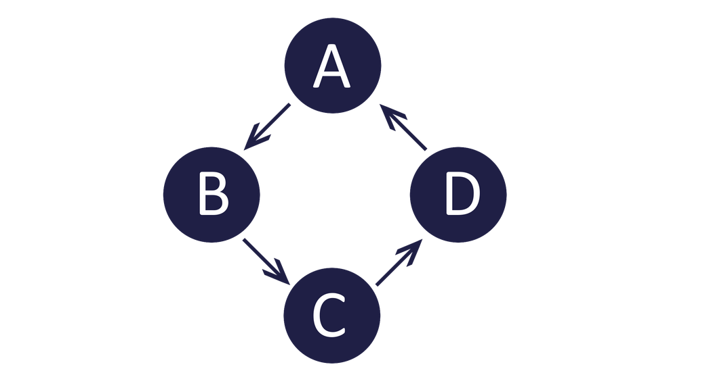
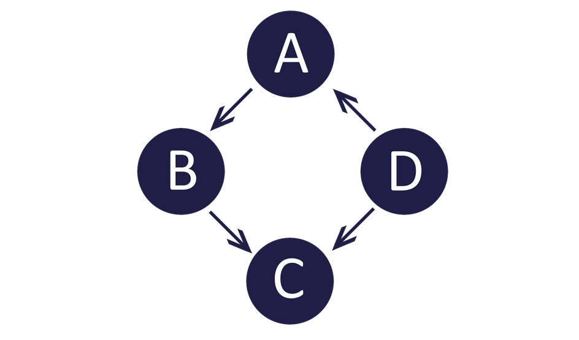
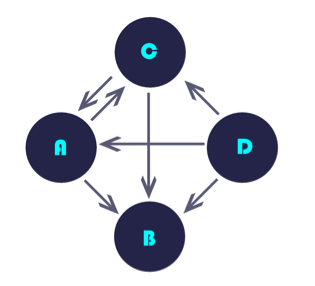
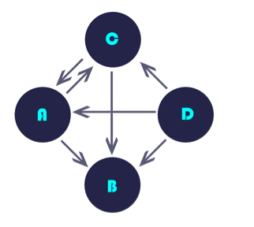
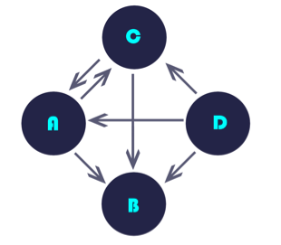
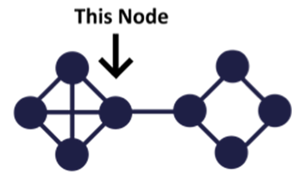
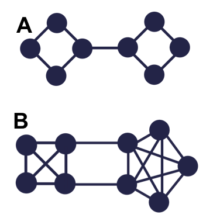

## Connectivity, Community, and Centrality Analytics
 

_Correct answers are in **bold**._
 

**Question 1**. The example given in the lectures of when a power network loses power in large portions of its service area was an example of what?

* **an attack which causes disconnection of the graph**

* a problem that can occur when centrality is too high

* high levels of connectivity which make it easy to bring a network down

**Question 2**. Is the following graph strongly connected, weakly connected or neither?

* weakly connected

* **strongly connected**

* neither

**Question 3**. Is the following graph strongly connected, weakly connected or neither?

* **weakly connected**

* strongly connected

* neither

**Question 4**. If you were going to look for a node which would be most likely to be the target of an attack to disconnect a network, what would be the best characteristic to look for?

* nodes that, if they were removed, would cause the graph to go from strongly connected to weakly connected

* **high degree nodes**

* low degree nodes

**Question 5**. What is the in-degree of node B?

* 0

* 1

* 2

* **3**

***Question 6**. In the graph below, which node is the greatest talker?

* A

* B

* C

* **D**

**Question 7**. In the graph below, which nodes are the greatest communicators? (Hint: there's a tie)

* **A**

* B

* **C**

* D

**Question 8**. What would we be looking for if we followed the steps below? Note: we have 2 graphs.

    Create a table for each graph where, for each node, you list the degree of the node.
    For each graph, create a histogram indicating how many nodes in that graph have a specific degree (e.g., how many nodes have degree 1? 2? etc.).
    Use advanced approaches (e.g. Euclidean distances) to compare these two histograms.

* Centrality

* Connectivity

* **Similarity**

* Community

**Question 9**. Which of the following are the three type of analytics questions asked about communities?

* **Static**

* **Evolution**

* **Prediction**

* Connection

**Question 10**. What type of community analytics question is the following?

Did a community form on twitter around the 2014 World Cup in Brazil?

* Connection

* Static

* Prediction

* **Evolution**

**Question 11**. Which type of community analytics question is the following?

How tightly knit was the 2014 World Cup twitter community on July 13, 2014 (the day of the finals)?

* Evolution

* Connection

* Prediction

* **Static**

**Question 12**. What is the external degree of the node indicated in the graph below?

* **1**

* 2

* 3

* 4

**Question 13**. Which of the two graphs below is more modular?

* A

* **B**

**Question 14**. Which of the following community tracking phases best describes what (usually) happens a few months after two companies merge?

* Birth

* Split

* Death

* Merge

* **Contract**

* Grow

**Question 15**. An influencer in a network is defined as:

* **a node which can reach all other nodes quickly**

the biggest gossip in the network

a node which has heavy weight edges to at least 1/2 of the nodes in the network

**Question 16**. Which of the following are the 2 core “key player” problems that centrality analytics can address?

* **Which nodes' removal will maximally disrupt the network**

* What is the shortest path through a network

* **A set of nodes which can reach (almost) all other nodes**

* Which nodes have the highest ratio of out-degree nodes to in-degree nodes

**Question 17**. What kind of centrality would you want to analyze in a graph if you wanted to inject information that flows through the shortest path in a network and have it spread quickly?

**Closeness**

* Between-ness

* Group

* Degree

**Question 18**. What kind of centrality would you want to analyze in a graph if you wanted maximize commodity flow in a network?

* Degree

* Group

* Closeness

* **Between-ness**

**Question 19**. What kind of centrality identifies "hubness"?

* Between-ness

* Group

* **Degree**

* Closeness
