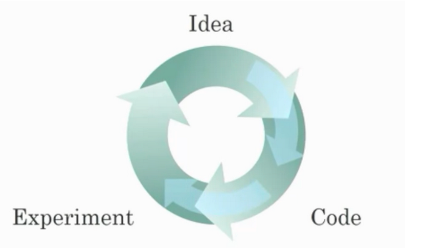
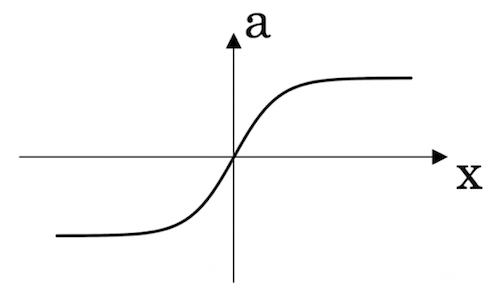
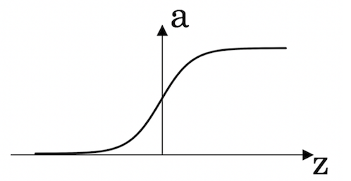
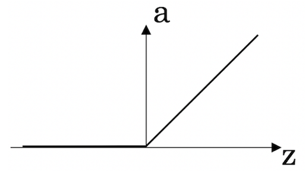
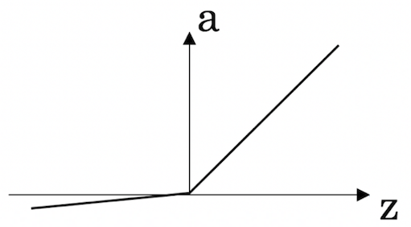
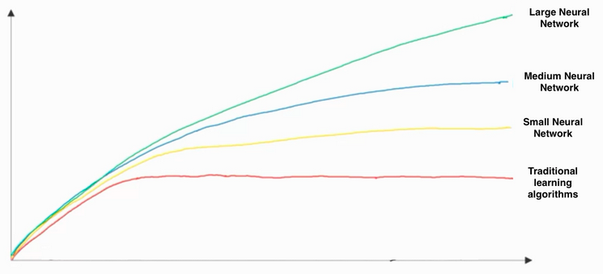

## Introduction to deep learning
 

_Correct answers are in **bold**._
 

**Question 1**. What does the analogy “AI is the new electricity” refer to?

* AI is powering personal devices in our homes and offices, similar to electricity.

* Through the “smart grid”, AI is delivering a new wave of electricity.

* **Similar to electricity starting about 100 years ago, AI is transforming multiple industries.**

* AI runs on computers and is thus powered by electricity, but it is letting computers do things not possible before.

**Question 2**. Which of these are reasons for Deep Learning recently taking off? (Check the three options that apply.)

* **Deep learning has resulted in significant improvements in important applications such as online advertising, speech recognition, and image recognition.**

* Neural Networks are a brand new field.

* **We have access to a lot more data.**

* **We have access to a lot more computational power.**

**Question 3**. Recall this diagram of iterating over different ML ideas. Which of the statements below are true? (Check all that apply.)

* **Being able to try out ideas quickly allows deep learning engineers to iterate more quickly.**

* **Faster computation can help speed up how long a team takes to iterate to a good idea.**

* It is faster to train on a big dataset than a small dataset.

* **Recent progress in deep learning algorithms has allowed us to train good models faster (even without changing the CPU/GPU hardware).**

**Question 4**. When an experienced deep learning engineer works on a new problem, they can usually use insight from previous problems to train a good model on the first try, without needing to iterate multiple times through different models. True/False?

* True

* **False**

**Question 5**. Which one of these plots represents a ReLU activation function?

* Figure 1:

* Figure 2:

* **Figure 3:**

* Figure 4:

**Question 6**. Images for cat recognition is an example of “structured” data, because it is represented as a structured array in a computer. True/False?

* True

* **False**

**Question 7**. A demographic dataset with statistics on different cities' population, GDP per capita, economic growth is an example of “unstructured” data because it contains data coming from different sources. True/False?

* True

* **False**

**Question 8**. Why is an RNN (Recurrent Neural Network) used for machine translation, say translating English to French? (Check all that apply.)

* **It can be trained as a supervised learning problem.**

* It is strictly more powerful than a Convolutional Neural Network (CNN).

* **It is applicable when the input/output is a sequence (e.g., a sequence of words).**

* RNNs represent the recurrent process of Idea->Code->Experiment->Idea->....

**Question 9**. In this diagram which we hand-drew in lecture, what do the horizontal axis (x-axis) and vertical axis (y-axis) represent?

*   x-axis is the performance of the algorithm. y-axis (vertical axis) is the amount of data.

*   x-axis is the input to the algorithm. y-axis is outputs.

*   x-axis is the amount of data. y-axis is the size of the model you train. 

*   **x-axis is the amount of data. y-axis (vertical axis) is the performance of the algorithm.**

**Question 10**. Assuming the trends described in the previous question's figure are accurate (and hoping you got the axis labels right), which of the following are true? (Check all that apply.)

* Decreasing the size of a neural network generally does not hurt an algorithm’s performance, and it may help significantly.

* Decreasing the training set size generally does not hurt an algorithm’s performance, and it may help significantly.

* **Increasing the size of a neural network generally does not hurt an algorithm’s performance, and it may help significantly.**

* **Increasing the training set size generally does not hurt an algorithm’s performance, and it may help significantly.**

